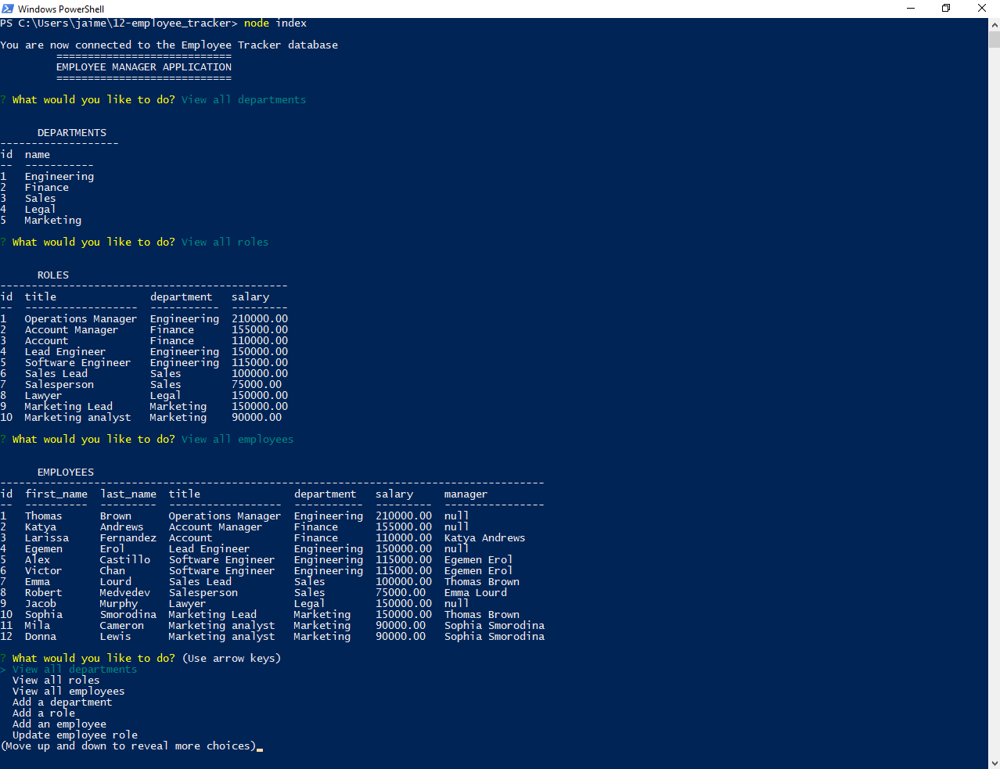
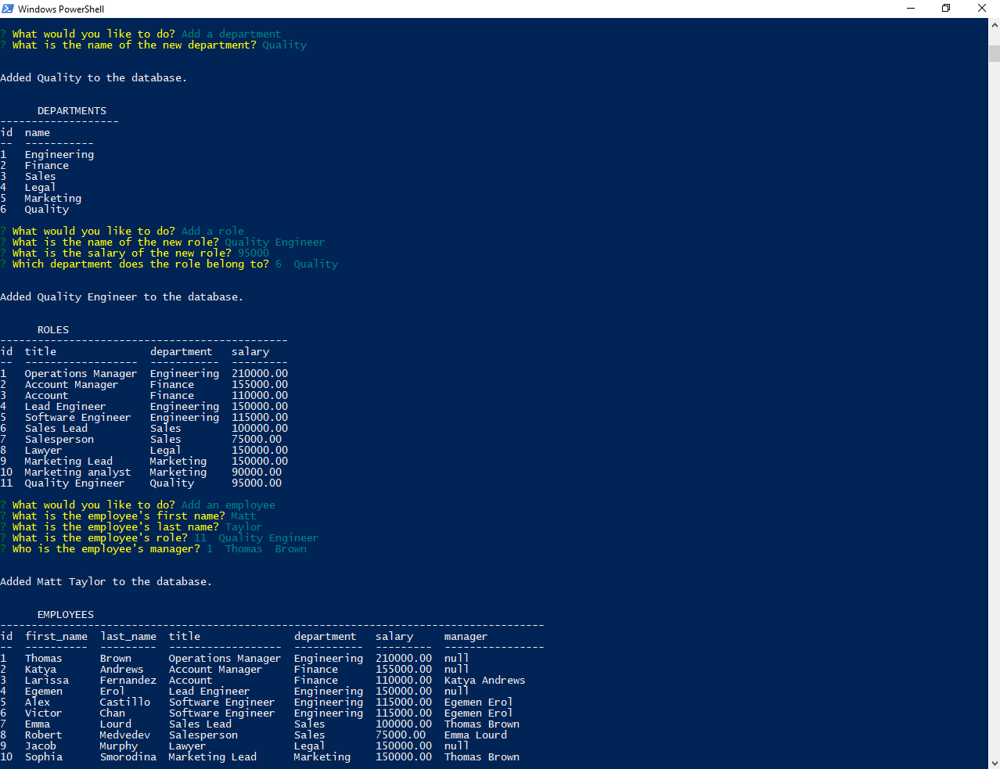

# Employee Tracker

## Table of Contents

- [Project Description](#Project-Description)
- [User Story](#User-Story)
- [Usage](#Usage)
- [Screen Captures](#Screen-Captures)
- [Technologies](#Technologies)
- [Questions](#Questions)
- [Links](#Links)
- [License](#License)

## Project Description
A command-line Content Management System (CMS) application to manage a company's employee database. The application gives access to the company database to perform different functions such as viewing the company's departments, roles and employees. Furthermore, the app also allows the user to add new departments, roles and employees, modify the employees' roles and managers and delete employees. The Employee Tracker is built using JavaScript, Node.js and MySQL. The Inquirer and MySQL2 npm packages were also used in the development of this app.
###### [Back to Index](#Table-of-Contents)

## User Story

```
AS A business owner
I WANT to be able to view and manage the departments, roles, and employees in my company
SO THAT I can organize and plan my business
```
###### [Back to Index](#Table-of-Contents)

## Usage
To run the Employee Tracker, the user must have Node.js installed. In addition,MySQL2, dotenv (to protect SQL passwords), Inquirer.js (version 8.2.4), and console.table must be installed in the directory of the project as follows:

```
$ npm init
$ npm install --save mysql2
$ npm i inquirer@8.2.4
$ npm install console.table --save
$ npm install dotenv --save
```
Then, clone this repo and in the .env file add the user and password of MySQL:
```
DB_USER = root
DB_PASS = user_password
```
Then, from the command line run:
```
$ node index
```
###### [Back to Index](#Table-of-Contents)

## Screen Captures


###### [Back to Index](#Table-of-Contents)

## Technologies
- JavaScript
- Node.js
- SQL
###### [Back to Index](#Table-of-Contents)

## Questions
Please, feel free to get in touch with me at any member of the development team to discuss any inquiries or suggestions for the project. We will be happy to connect with you!
###### [Back to Index](#Table-of-Contents)

## Links
- [Application Repository](https://github.com/AlexJCturbo/employee-tracker)
- [Walkthrough Video](https://drive.google.com/file/d/1brN2VEGvNoIK7eezRBjZwGnOidEBxGaj/view?usp=sharing)
###### [Back to Index](#Table-of-Contents)


## License
MIT License

Copyright (c) 2022 Alejandro Jaimes

Permission is hereby granted, free of charge, to any person obtaining a copy of this software and associated documentation files (the "Software"), to deal in the Software without restriction, including without limitation the rights to use copy, modify, merge, publish, distribute, sublicense, and/or sell copies of the Software, and to permit persons to whom the Software is furnished to do so, subject to the following conditions:

The above copyright notice and this permission notice shall be included in all copies or substantial portions of the Software.

THE SOFTWARE IS PROVIDED "AS IS", WITHOUT WARRANTY OF ANY KIND, EXPRESS OR IMPLIED, INCLUDING BUT NOT LIMITED TO THE WARRANTIES OF MERCHANTABILITY, FITNESS FOR A PARTICULAR PURPOSE AND NONINFRINGEMENT. IN NO EVENT SHALL THE AUTHORS OR COPYRIGHT HOLDERS BE LIABLE FOR ANY CLAIM, DAMAGES OR OTHER LIABILITY, WHETHER IN AN ACTION OF CONTRACT, TORT OR OTHERWISE, ARISING FROM, OUT OF OR IN CONNECTION WITH THE SOFTWARE OR THE USE OR OTHER DEALINGS IN THE SOFTWARE.
###### [Back to Index](#Table-of-Contents)
